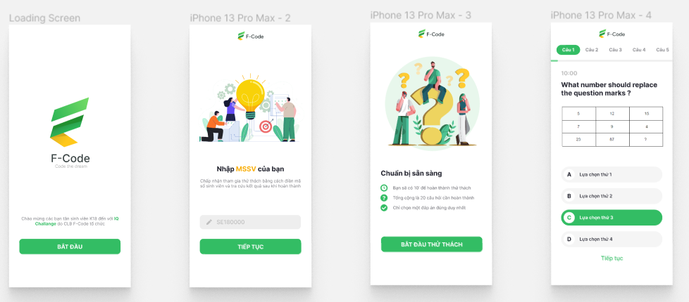
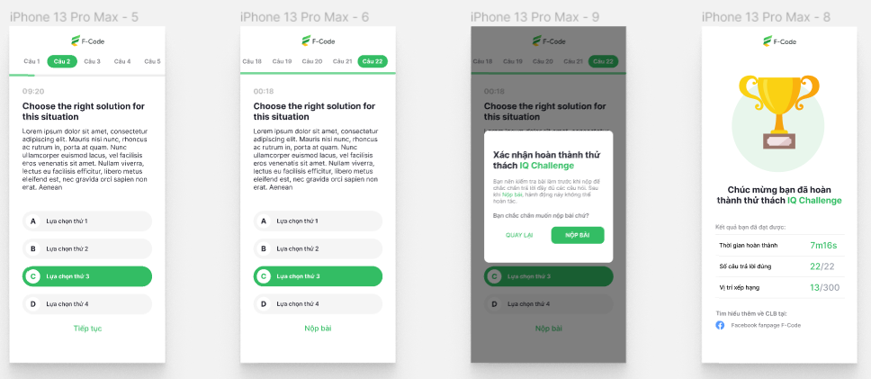

# Minigame QR Code - FE

## Description

A quiz game website of F-code club for the orientation to welcome K18 of FPT University HCM.

The player will receive a card with a QR code to have only 1 chance to add name and play.

Here is [the demo](https://iq-challenge.vercel.app/)

<!-- Here is [the Backend](https://github.com/kien123456k/minigameQR-backend) that this app using. -->

## Technology

-   Frontend
    -   React - A JavaScript library for building user interfaces
-   Backend
    -   Express - Server Core
    -   Mongoose + Mongo - Database

## Some Preview Images

## Team Members

-   Tran Hai Dang
-   Tran Van Tho
<!-- -   Bùi Ngọc Huy -->

# License & copyright

© Tran Hai Dang, FPT University TP.HCM
Licensed under the [MIT LICENSE](LICENSE).
